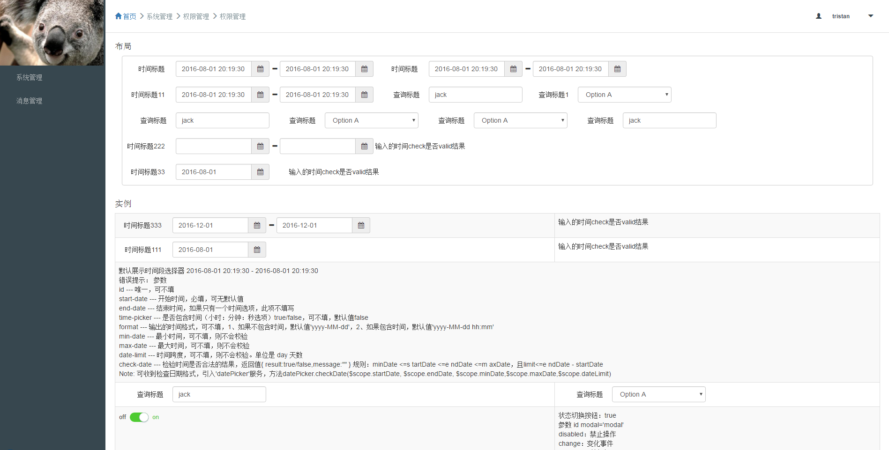

# Rylai 

## What is Rylai

Rylai is a angular directive and service lib 

## demo
[https://tristandongmaster.github.io/angular-ui-platform/example/index#/home](https://tristandongmaster.github.io/angular-ui-platform/example/index#/home)


## 版本

当前版本 0.0.1

历史版本 0.0.1

## 依赖

jquery bootstrap nprogress bootstrap-datepicker

## How we build Rylai
	
	//compline for develop
	npm run dev

	//compline for production
	npm run build

	//start a node serve 
	npm run serve

	// open url
	http://localhost:3000/example/index.html#/home

## service api

	http

### 1 http

+ get(url,param,callback)

send a get api req

url :  string require

param : object require. if null,pass ```{}```

callback: function 


+ post(url,param,fn)

send a post api req

## directive

### 1 标题

iceHeader

用法：

	<ice-head title="这是个标题"></ice-head>

参数：

	title 标题文本 必须

### 2 按钮

iceButton

用法：

	<ice-button text='查询' hanle-click='queryFn()'/>

	$scope.queryFn = function(){.....}

参数：

	text ： string 按钮标题 必须

	hanle-click : function 处理点击事件

### 2 表单输入 Input

ice-input

用法 ： 

	<ice-input value='username' palceholder='请输入用户名'/>

	$scope.username = ''

参数：	

	value : ng model 必须

	palceholder ： string 


### 3 表单输入 Select

ice-select

用法 ：

	<ice-label-select  option='select2.option' value='select2.model' />

	$scope.select2 = {
	    model: '1',
	    option: [
	      {value: '1', name: 'Option A'},
	      {value: '2', name: 'Option B'},
	      {value: '3', name: 'Option C'}
	    ]
	};

参数：

	option : array 必须 数组元素对象必须是 {value: '1', name: 'Option A'}  这种形式

	value : ng model ，表示 select 当前选中的项目的值

### 4 Row

ice-row

对 bt 的 row col 一次封装

用法 ：

	<ice-row>
		。。。。。。
	</ice-row>	

参数： element

### LabelInput

iceLabelInput

带标题的输入框，用于查询

用法：

	<ice-label-input label='查询标题:' value='name' placeholder='some placeholder' />

参数：

类似 ice-input ，多了一个 label


### LabelSelect

iceLabelSelect


用法：

	<ice-label-select label='查询标题:' option='select2.option' value='select2.model' />

参数：

类似 ice-select ，多了一个 label

### 5 日期控件 DatePicker

ice-date-picker

用法 ：

	<ice-date-picker id="first" is-one='true' is-time='true' 
  	start-date="time.start" 
    format='yyyy/MM/dd hh:mm:ss'>开始时间</ice-date-picker>

	$scope.time = {
	    start: '2015-08-01'
	};

参数：

	id :  必须 唯一

	is-one : 可选， 是否为单个时时间控件

	is-time ： 可选， 是否带时间
	
	start-date ： ng model， 时间

	format ： 可选， 时间格式


